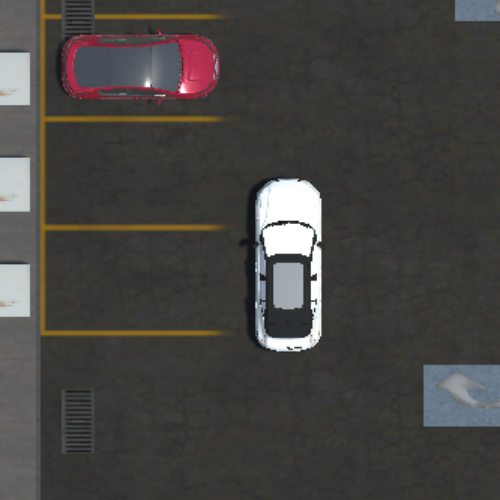

# Android BEV App — Bird's-Eye View on Android

> Pure-Kotlin surround-view stitching from four fisheye cameras, running entirely on a Jetson Nano with Android TV. No server. No neural network at runtime. No GPU required.

**Part of the Appraid Project · March 2026**

---

## Overview

This app takes four fisheye camera images — front, left, rear, right — and computes a single top-down bird's-eye view (BEV) of the ground around the vehicle using classical inverse perspective mapping (IPM) and the Mei unified fisheye projection model.

The entire pipeline runs in pure Kotlin on the Jetson Nano CPU. There are no Python dependencies, no network calls, no AI inference at runtime, and no GPU required. Every output pixel is traceable to a geometric formula.

---

## Output

| BEV Output | Ground Truth (FB-SSEM dataset) |
|---|---|
|  |  |

- **Resolution:** 500 × 500 px
- **Coverage:** 10 m × 10 m ground area (5 m in each direction from rear axle)
- **Scale:** 2 cm per pixel
- **Compute time:** ~3 seconds on Jetson Nano CPU

---

## Hardware

| Component | Details |
|---|---|
| Board | NVIDIA Jetson Nano |
| OS | LineageOS / Android TV |
| CPU | ARM Cortex-A57 quad-core @ 1.43 GHz |
| RAM | 4 GB LPDDR4 |
| Cameras | 4× fisheye (front, left, rear, right) |
| Camera resolution | 1280 × 1080 px |
| Android target | API 23 (Android 6.0+) |

---

## Project Structure

```
Android-BEV-App/
│
├── app/
│   └── src/main/
│       ├── assets/
│       │   └── bev_images/            ← Fisheye images
│       │       ├── front/0.png
│       │       ├── left/0.png
│       │       ├── rear/0.png
│       │       ├── right/0.png
│       │       └── bev/0.png          ← Ground truth overhead image
│       ├── java/com/example/bevviewer/
│       │   ├── ui/theme/
│       │   │   ├── Color.kt
│       │   │   ├── Theme.kt
│       │   │   └── Type.kt
│       │   ├── BevProcessor.kt        ← Core IPM algorithm — all geometry lives here
│       │   └── MainActivity.kt        ← Jetpack Compose TV UI and orchestration
│       ├── res/                       ← icons, strings, themes
│       └── AndroidManifest.xml
│
├── Camera Calibration Parameters/         
│   ├── camera_intrinsics.yml          ← Calibrated fisheye lens parameters
│   └── camera_positions_for_extrinsics.txt
│
├── docs/
│   ├── index.html                     ← landing page 18-slide engineering presentation (GitHub Pages)
│   ├── appraid_bev_system_flowchart.jpg
│   ├── bev_animated_flowchart.html    ← Full pipeline flowchart
│   ├── bev_output.png                 ← output image
│   ├── ground_truth.png               
│
├── gradle/
│   ├── wrapper/
│   │   ├── gradle-wrapper.jar
│   │   └── gradle-wrapper.properties
│   └── libs.versions.toml
│
├── .gitignore
├── LICENSE
├── README.md
├── build.gradle.kts
├── gradle.properties
├── gradlew
├── gradlew.bat
└── settings.gradle.kts

```

---

## Camera Calibration

### Intrinsics — `camera_intrinsics.yml`

Calibrated using a 9×6 checkerboard with 24.23 mm square size.
The camera model is the **Mei Unified Projection Model** (single-mirror omnidirectional model).

| Parameter | Value | Description |
|---|---|---|
| ξ (xi) | `1.0866311153248236` | Mei fisheye distortion parameter |
| fx | `659.9565405462982` px | Horizontal focal length |
| fy | `625.1032520893773` px | Vertical focal length |
| cx | `634.6329612029243` px | Principal point X |
| cy | `544.7433055928482` px | Principal point Y |
| skew | `-2.8848508379788056` | Sensor axis skew (α = skew/fx = −0.004371) |
| k1 | `-0.2900269437421997` | Radial distortion coefficient 1 |
| k2 | `0.11089496468175668` | Radial distortion coefficient 2 |
| p1 | `-0.0003222479159157141` | Tangential distortion coefficient 1 |
| p2 | `0.0029110573007121382` | Tangential distortion coefficient 2 |
| Image size | 1280 × 1080 px | Native camera resolution |

The full 3×3 camera matrix K from the yml file:

```
K = [ 659.957  -2.885  634.633 ]
    [   0.0   625.103  544.743 ]
    [   0.0     0.0      1.0   ]
```

The distortion vector D:
```
D = [ k1=-0.290,  k2=0.111,  p1=-0.000322,  p2=0.00291 ]
```

---

### Extrinsics — `camera_positions_for_extrinsics.txt`

**Coordinate origin:** centre of the rear axle.
**Axes:** X = forward, Y = up, Z = out of the right side (Unity convention).

> **Note on rz = 180°:** The front and rear cameras are physically mounted
> upside-down on the vehicle. The code compensates by rotating those bitmaps
> 180° before processing — the rotation math uses rz = 0 in all cases,
> matching the behaviour of the original Python reference script
> (`computeNormalizedReferencePoints.py`).

| Camera | pos_x (m) | pos_y (m) | pos_z (m) | rot_x (°) | rot_y (°) | rot_z (°) | In code |
|---|---|---|---|---|---|---|---|
| front | 0.000 | 0.406 | 3.873 | 26 | 0 | 180 | bitmap flipped 180° |
| right | 1.015 | 0.801 | 2.040 | 0 | 90 | 0 | no flip |
| left | -1.024 | 0.800 | 2.053 | 0 | -90 | 0 | no flip |
| rear | 0.132 | 0.744 | -1.001 | 3 | 180 | 180 | bitmap flipped 180° |

**Unity → OpenCV coordinate conversion** applied in code:
```
rot_cv = [-rx, ry, 0]           # rz always treated as 0; handled by bitmap flip
pos_cv = [px, -py, pz]
R_c2w  = from_euler('ZYX', [0, ry_cv, rx_cv])
R_w2c  = R_c2w^T
t_w2c  = -R_c2w^T × pos_cv
```

---

## Algorithm

The pipeline uses **Inverse Perspective Mapping (IPM)**. Instead of projecting camera pixels forward onto the ground, it works in reverse — for every pixel in the output top-down image, it finds which camera pixel shows that ground location.

### The 6-step pipeline (per output pixel, per camera)

**A — World coordinates**
Convert BEV pixel `(row, col)` to real-world ground position in metres.
```
worldX = 5.0 − row × 0.02      # metres forward from rear axle
worldY = −5.0 + col × 0.02     # metres rightward from rear axle
```

**B — Camera transform**
Rotate the world direction vector into the camera's local coordinate frame using the pre-built 3×3 rotation matrix.
```
[xc, yc, zc] = R_w2c × [worldX, worldY, CAM_HEIGHT]
```
If `zc < 0`, the ground point is behind the camera — skip.

**C — Mei fisheye projection with distortion**
```
r3d  = √(xc² + yc² + zc²)
mzXi = zc/r3d + ξ              # if ≤ 0, behind mirror — skip

# Normalised (undistorted) coordinates
un = (xc/r3d) / mzXi
vn = (yc/r3d) / mzXi

# Radial + tangential distortion
ρ² = un² + vn²
L  = k1·ρ² + k2·ρ⁴
ud = un·(1+L) + 2·p1·un·vn + p2·(ρ²+2·un²)
vd = vn·(1+L) + p1·(ρ²+2·vn²) + 2·p2·un·vn

# Final pixel (including skew α)
u = fx·(ud + α·vd) + cx
v = fy·vd + cy
```

**D — Blend weight**
```
cosA   = (cos(yaw)·worldX + sin(yaw)·worldY) / dist
weight = cosA^1.5 / dist        # skip if cosA ≤ 0.1
```

**E — Bilinear interpolation**
```
colour = c00·(1−du)(1−dv) + c01·du(1−dv) + c10·(1−du)dv + c11·du·dv
```

**F — Weighted accumulation and normalisation**
```
bevR[i] += weight·R    bevG[i] += weight·G    bevB[i] += weight·B
totalW[i] += weight

# After all cameras:
finalRGB = (bevR/totalW, bevG/totalW, bevB/totalW)  clamped 0–255
```

---

## Build & Run

### Prerequisites

- Android Studio (latest stable)
- Android SDK API 23+
- Jetson Nano running LineageOS / Android TV, or any Android TV device / emulator

### Steps

1. Clone the repository:
   ```bash
   git clone https://github.com/HassanTarekAppraid/Android-BEV-App.git
   ```

2. Open in Android Studio: **File → Open** → select the cloned folder

3. Wait for Gradle sync to complete

4. Place your fisheye images in:
   ```
   app/src/main/assets/bev_images/{front,left,rear,right}/0.png
   ```
   Images must be 1280 × 1080 px (or will be auto-scaled).

5. Connect your device and click **Run** (Shift+F10)

### `local.properties`

Not included in the repo (machine-specific). Create manually if needed:
```
sdk.dir=C\:\\Users\\YourName\\Android\\SDK
```

---

## UI

Built with **Jetpack Compose for TV** (TV Material3). Designed for remote control D-pad navigation.

| Button | Action |
|---|---|
| Compute BEV | Loads images and runs the full IPM pipeline on a background thread |
| Show Groundtruth / Show Appraid BEV | Toggles between computed BEV and GT comparison |
| Capture BEV | Saves BEV PNG to `/sdcard/Documents/BevSnapshots/bev_output.png` |
| Capture GT | Saves ground truth image |
| Capture Fisheye | Saves all four fisheye input images |

---

## Limitations

These are fundamental physical constraints of IPM, not software bugs.

**Side lane blur** — Lanes 4–6 m lateral are seen by the side cameras at < 10° above horizontal. At this angle, 1 px fisheye error ≈ 50 cm ground error. Cannot be fixed without AI or depth sensing.

**3D object warping** — IPM assumes Y = 0 everywhere. Other vehicles, walls, and pedestrians appear stretched because their actual height is non-zero.

**Car body artifact** — Side cameras project the ego vehicle's own body into the BEV. Covered by the car box overlay. Unavoidable in all camera-only IPM systems.

---

## Method Comparison

| | Classical IPM (this project) | Deep Learning BEV | Hybrid IPM + ML |
|---|---|---|---|
| Training data | None | Thousands of images | Some |
| GPU required | No | Yes | Yes |
| Side lane quality | Blurry (physics) | Sharp | Sharp |
| Explainability | Full | Black box | Partial |
| APK size | Minimal | +50–200 MB | Moderate |

---

## Roadmap

- [ ] Real-time camera feed via Android Camera2 API
- [ ] Multi-threaded pixel loop with Kotlin coroutines → target < 1 second
- [ ] F2BEV neural network refinement for side-lane correction
- [ ] Port to Android Automotive OS (AAOS) with EVS camera access

---

## References

- Mei, C. & Rives, P. (2007). *Single View Point Omnidirectional Camera Calibration from Planar Grids.* ICRA 2007.
- Li, Z. et al. (2023). *FB-SSEM: Forward-looking Binocular Surround-view Semantic Estimation and Mapping.* [arXiv:2303.03651](https://arxiv.org/abs/2303.03651)
- Google. *Android Automotive OS Developer Documentation.* [source.android.com/docs/automotive](https://source.android.com/docs/automotive)

---

## License

MIT License. The FB-SSEM dataset is subject to its own license — see the original paper.

---

*Appraid Project · Hassan Tarek · March 2026*
